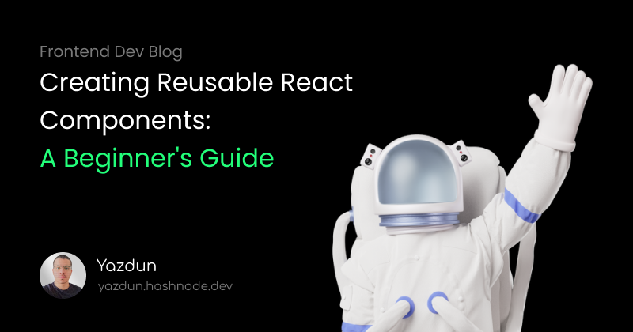

complete the readme file ...

<!-- PROJECT LOGO -->
 

  

<h3 align="center">Creating Reusable React Components</h3>

  

    A Beginner's Guide
     
    <a href="https://yazdun.hashnode.dev/creating-reusable-react-components"><strong>Read on Hashnode »</strong></a>
     
     
    <a href="https://react-create-reusable-components.netlify.app/">View Demo</a>
    ·
    <a href="https://github.com/Yazdun/react-create-reusable-components/issues">Report Bug</a>
    ·
    <a href="https://github.com/Yazdun/react-create-reusable-components/issues">Request Feature</a>
  

# Introduction

Welcome to my Github repository for creating reusable React components! In this
repository, I demonstrate how to create three reusable components - a Button
component, a Container component, and an Input component - and show you how to
wire them up together to build an app. This code is intended to be a helpful
starting point for anyone looking to create their own reusable components in
React. So, let's get started!

# Getting Started

To get started with this repository, I recommend you to read my
[Creating Reusable React Component](https://yazdun.hashnode.dev/creating-reusable-react-components)
blog post on hashnode where I demonstrate how to use this repository properly.

In case you just want to run the final version on your machine and explore the
code on your own, please follow this steps below:

1. Install Node.js on your machine if you haven't already. You can download it
   from the official website https://nodejs.org/en/download/

2. Clone this repository to your local machine by running the following command
   in your terminal:

   `git clone https://github.com/username/repository.git`

   Replace "username" with the actual username of the repository owner and
   "repository" with the name of the repository.

3. Navigate to the project directory using the terminal:

   `cd repository`

   Replace "repository" with the actual name of the repository.

4. Install the project dependencies by running the following command in your
   terminal:

   `npm install`

   This will install all the required packages and dependencies for the project.

5. Start the project by running the following command in your terminal:

   `npm start`

   This will start the project on your local machine and you can access it in
   your web browser by navigating to http://localhost:3000/

That's it! You have successfully started the project on your local machine. If
you encounter any issues, Feel free to open an issue on GitHub and I will do my
best to assist you.

# Support me ❤️

If you find this repository useful and you want me to do more of these, make
sure to leave a star ⭐ on this repository and follow me on social media so you
won't miss any new content. I create content about ReactJS and I'll help you to
sharpen your skills in frontend development.

- Twitter: [@Yazdun](https://twitter.com/Yazdun)
- LinkedIn: [Yazdun Fadali](www.linkedin.com/in/yazdun-fadali)
- Frontend Mentor: [Yazdun](https://www.frontendmentor.io/profile/Yazdun)
- Hashnode: [Yazdun](https://yazdun.hashnode.dev/)
